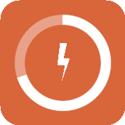
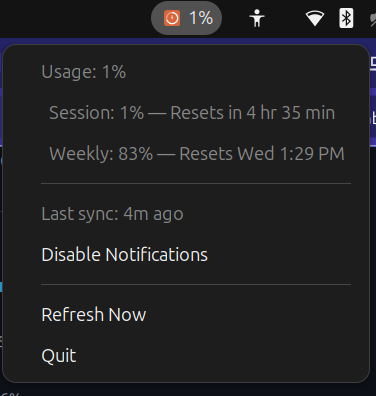

# claude-meter

Real-time Claude usage in your system tray. Single Go binary — requires the browser extension.





Works on **macOS** and **Ubuntu/Linux**.

---

## Quick Start

### 1. Install the app

```bash
curl -fsSL https://raw.githubusercontent.com/sijokurian/claude-meter/main/install.sh | bash
```

### 2. Install the browser extension

1. Open `chrome://extensions` in Chrome (or any Chromium-based browser)
2. Enable **Developer mode** (toggle in the top-right)
3. Click **Load unpacked**
4. Select the `extension/` folder inside this repo

### 3. Login to [claude.ai](https://claude.ai) in Chrome

The tray icon turns orange and shows your current session usage.

---

## What it shows

```
Usage: 51%
  Session: 51% — Resets in 2 hr 23 min
  Weekly: 80% — Resets Wed 1:30 PM
────────────────
Last sync: just now
Disable Notifications
────────────────
Refresh Now
Quit
```

Session and weekly percentages with reset times come directly from claude.ai via the browser extension.

### Alerts

Desktop notification at every 10% milestone (10%, 20%, ... 90%). Toggle from the menu.

---

## Other install methods

### Manual

Download the binary for your platform from [Releases](https://github.com/sijokurian/claude-meter/releases), make it executable, and run:

```bash
chmod +x claude-meter
./claude-meter
```

### Build from source

**Prerequisites:**

- Go 1.22+
- GTK3 dev headers (Linux only):

```bash
# Ubuntu / Debian
sudo apt install libgtk-3-dev

# Fedora
sudo dnf install gtk3-devel

# Arch
sudo pacman -S gtk3
```

**Build and run:**

```bash
git clone https://github.com/sijokurian/claude-meter.git
cd claude-meter
go build -o claude-meter .
./claude-meter
```

---

## Uninstall

**macOS**
```bash
launchctl unload ~/Library/LaunchAgents/com.claude.usagebar.plist
rm -f ~/.local/bin/claude-meter ~/Library/LaunchAgents/com.claude.usagebar.plist
```

**Linux**
```bash
rm -f ~/.local/bin/claude-meter ~/.config/autostart/claude-usage.desktop
```

---

## Privacy

All data is processed locally on your machine. Nothing is sent to any external server, third party, or cloud service.

The extension **does not make any API requests to Claude**. It passively reads data the browser is already loading by intercepting fetch responses — no extra network requests. The only outbound request the extension makes is to **`localhost:52413`** — your own desktop app on your machine.

Settings stored locally at `~/.config/claude-meter/settings.json` (Linux) or `~/Library/Application Support/claude-meter/settings.json` (macOS). Only stores notification preference.

- No analytics, telemetry, tracking, or remote data collection of any kind.
